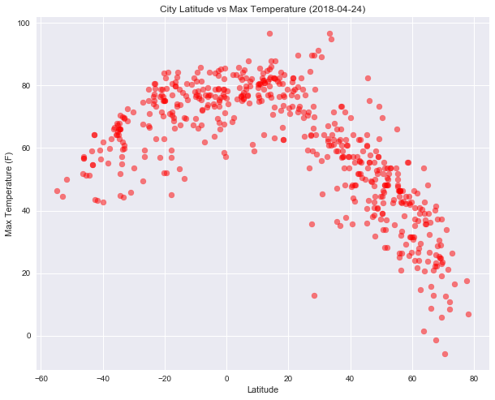
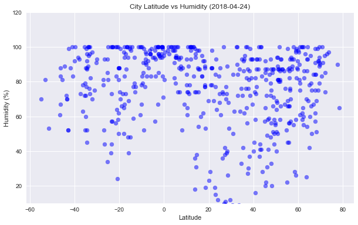
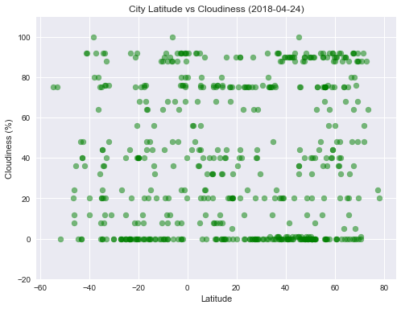
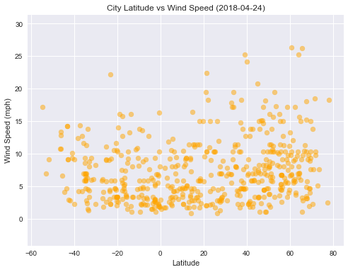

Observable Trends:

1. Temperature increases as you get closer latitude approaches the equator.
2. The cooler the temperature the lower the humidity.  
3. The higher the altitude the higher the wind speed. 


```python
# import dependencies
import random # random to generate random latitude and longitudes
import pandas as pd # pandas library
import time 
import seaborn as sns # seaborn library to set the aesthetics for the graphs
import matplotlib.pyplot as plt # for creating/plotting graphs
import numpy as np
from datetime import datetime
import openweathermapy as owm
import csv
from citipy import citipy 
```


```python
# to Look up for city names with geo-coordinates
cities = []

while len(cities)<600:
    x = (random.choice(range(-90,90))) # randomly generate numbers in range -90 & 90 for latitude
    y = (random.choice(range(-180,180))) # randomly generagte numbers in range -180 & 180 for longitude
    city = citipy.nearest_city(x,y).city_name # look up city to match the lat & long randomly generated
    if city not in cities:
        cities.append(city)
```


```python
# import API Key from config file
from config import api_key
# Create settings dictionary with information we're interested in
settings = {"units": "imperial", "appid": api_key}

# Initialize data frame to store data from API calls
WeatherPy_df =pd.DataFrame(columns = ["City","Cloudiness", "Country",
                                    "Date", "Max Temp", "Wind Speed", 
                                    "Lat","Lng", "Humidity"])
```


```python
count = 1 
err = 0 
sets = 0 
index = 0 

#current time
t0 =time.time()

for city in cities:
    try:
        city1 = city.replace(" ", "%20") # remove space in city name so the URL retrieved is not broken.
        print(f'Processing Record {count} of Set {sets} | {city}' )
        print(f'{owm.BASE_URL}weather?q={city1}&units=imperial&APPID={api_key}')
        city_stats = owm.get_current(city, **settings)
        WeatherPy_df.set_value(index, "City", city_stats["name"])
        WeatherPy_df.set_value(index, "Cloudiness", city_stats("clouds.all"))
        WeatherPy_df.set_value(index, "Country", city_stats("sys.country"))
        WeatherPy_df.set_value(index, "Date", city_stats("dt"))
        WeatherPy_df.set_value(index, "Max Temp", city_stats("main.temp_max"))
        WeatherPy_df.set_value(index, "Wind Speed", city_stats("wind.speed"))
        WeatherPy_df.set_value(index, "Lat", city_stats("coord.lat"))
        WeatherPy_df.set_value(index, "Lng", city_stats("coord.lon"))
        WeatherPy_df.set_value(index, "Humidity", city_stats("main.humidity"))
        index = index +1 
    except Exception as e:
        print(e)
        err= err+1
    count = count+1
    if count == 51: 
        t1=time.time()
        count = 1 
        sets = sets+1
        time.sleep(60-(t1-t0))
        t0=time.time()


```

    Processing Record 1 of Set 0 | carnarvon
    http://api.openweathermap.org/data/2.5/weather?q=carnarvon&units=imperial&APPID=25bc90a1196e6f153eece0bc0b0fc9eb
    

    C:\ProgramData\Anaconda3\lib\site-packages\ipykernel_launcher.py:15: FutureWarning: set_value is deprecated and will be removed in a future release. Please use .at[] or .iat[] accessors instead
      from ipykernel import kernelapp as app
    C:\ProgramData\Anaconda3\lib\site-packages\ipykernel_launcher.py:16: FutureWarning: set_value is deprecated and will be removed in a future release. Please use .at[] or .iat[] accessors instead
      app.launch_new_instance()
    C:\ProgramData\Anaconda3\lib\site-packages\ipykernel_launcher.py:17: FutureWarning: set_value is deprecated and will be removed in a future release. Please use .at[] or .iat[] accessors instead
    C:\ProgramData\Anaconda3\lib\site-packages\ipykernel_launcher.py:18: FutureWarning: set_value is deprecated and will be removed in a future release. Please use .at[] or .iat[] accessors instead
    C:\ProgramData\Anaconda3\lib\site-packages\ipykernel_launcher.py:19: FutureWarning: set_value is deprecated and will be removed in a future release. Please use .at[] or .iat[] accessors instead
    C:\ProgramData\Anaconda3\lib\site-packages\ipykernel_launcher.py:20: FutureWarning: set_value is deprecated and will be removed in a future release. Please use .at[] or .iat[] accessors instead
    C:\ProgramData\Anaconda3\lib\site-packages\ipykernel_launcher.py:21: FutureWarning: set_value is deprecated and will be removed in a future release. Please use .at[] or .iat[] accessors instead
    C:\ProgramData\Anaconda3\lib\site-packages\ipykernel_launcher.py:22: FutureWarning: set_value is deprecated and will be removed in a future release. Please use .at[] or .iat[] accessors instead
    C:\ProgramData\Anaconda3\lib\site-packages\ipykernel_launcher.py:23: FutureWarning: set_value is deprecated and will be removed in a future release. Please use .at[] or .iat[] accessors instead
    

    Processing Record 2 of Set 0 | atuona
    http://api.openweathermap.org/data/2.5/weather?q=atuona&units=imperial&APPID=25bc90a1196e6f153eece0bc0b0fc9eb
    Processing Record 3 of Set 0 | katsuura
    http://api.openweathermap.org/data/2.5/weather?q=katsuura&units=imperial&APPID=25bc90a1196e6f153eece0bc0b0fc9eb
    Processing Record 4 of Set 0 | hilo
    http://api.openweathermap.org/data/2.5/weather?q=hilo&units=imperial&APPID=25bc90a1196e6f153eece0bc0b0fc9eb
    Processing Record 5 of Set 0 | palazzolo acreide
    http://api.openweathermap.org/data/2.5/weather?q=palazzolo%20acreide&units=imperial&APPID=25bc90a1196e6f153eece0bc0b0fc9eb
    Processing Record 6 of Set 0 | nizhneyansk
    http://api.openweathermap.org/data/2.5/weather?q=nizhneyansk&units=imperial&APPID=25bc90a1196e6f153eece0bc0b0fc9eb
    HTTP Error 404: Not Found
    Processing Record 7 of Set 0 | cockburn town
    http://api.openweathermap.org/data/2.5/weather?q=cockburn%20town&units=imperial&APPID=25bc90a1196e6f153eece0bc0b0fc9eb
    Processing Record 8 of Set 0 | inirida
    http://api.openweathermap.org/data/2.5/weather?q=inirida&units=imperial&APPID=25bc90a1196e6f153eece0bc0b0fc9eb
    Processing Record 9 of Set 0 | san cristobal
    http://api.openweathermap.org/data/2.5/weather?q=san%20cristobal&units=imperial&APPID=25bc90a1196e6f153eece0bc0b0fc9eb
    Processing Record 10 of Set 0 | mar del plata
    http://api.openweathermap.org/data/2.5/weather?q=mar%20del%20plata&units=imperial&APPID=25bc90a1196e6f153eece0bc0b0fc9eb
    Processing Record 11 of Set 0 | riyadh
    http://api.openweathermap.org/data/2.5/weather?q=riyadh&units=imperial&APPID=25bc90a1196e6f153eece0bc0b0fc9eb
    Processing Record 12 of Set 0 | busselton
    http://api.openweathermap.org/data/2.5/weather?q=busselton&units=imperial&APPID=25bc90a1196e6f153eece0bc0b0fc9eb
    Processing Record 13 of Set 0 | hihifo
    http://api.openweathermap.org/data/2.5/weather?q=hihifo&units=imperial&APPID=25bc90a1196e6f153eece0bc0b0fc9eb
    HTTP Error 404: Not Found
    Processing Record 14 of Set 0 | longyearbyen
    http://api.openweathermap.org/data/2.5/weather?q=longyearbyen&units=imperial&APPID=25bc90a1196e6f153eece0bc0b0fc9eb
    Processing Record 15 of Set 0 | kidal
    http://api.openweathermap.org/data/2.5/weather?q=kidal&units=imperial&APPID=25bc90a1196e6f153eece0bc0b0fc9eb
    Processing Record 16 of Set 0 | victor harbor
    http://api.openweathermap.org/data/2.5/weather?q=victor%20harbor&units=imperial&APPID=25bc90a1196e6f153eece0bc0b0fc9eb
    Processing Record 17 of Set 0 | sitka
    http://api.openweathermap.org/data/2.5/weather?q=sitka&units=imperial&APPID=25bc90a1196e6f153eece0bc0b0fc9eb
    Processing Record 18 of Set 0 | hobart
    http://api.openweathermap.org/data/2.5/weather?q=hobart&units=imperial&APPID=25bc90a1196e6f153eece0bc0b0fc9eb
    Processing Record 19 of Set 0 | kaitangata
    http://api.openweathermap.org/data/2.5/weather?q=kaitangata&units=imperial&APPID=25bc90a1196e6f153eece0bc0b0fc9eb
    Processing Record 20 of Set 0 | lasa
    http://api.openweathermap.org/data/2.5/weather?q=lasa&units=imperial&APPID=25bc90a1196e6f153eece0bc0b0fc9eb
    Processing Record 21 of Set 0 | opole lubelskie
    http://api.openweathermap.org/data/2.5/weather?q=opole%20lubelskie&units=imperial&APPID=25bc90a1196e6f153eece0bc0b0fc9eb
    Processing Record 22 of Set 0 | alekseyevsk
    http://api.openweathermap.org/data/2.5/weather?q=alekseyevsk&units=imperial&APPID=25bc90a1196e6f153eece0bc0b0fc9eb
    Processing Record 23 of Set 0 | bredasdorp
    http://api.openweathermap.org/data/2.5/weather?q=bredasdorp&units=imperial&APPID=25bc90a1196e6f153eece0bc0b0fc9eb
    Processing Record 24 of Set 0 | punta arenas
    http://api.openweathermap.org/data/2.5/weather?q=punta%20arenas&units=imperial&APPID=25bc90a1196e6f153eece0bc0b0fc9eb
    Processing Record 25 of Set 0 | najran
    http://api.openweathermap.org/data/2.5/weather?q=najran&units=imperial&APPID=25bc90a1196e6f153eece0bc0b0fc9eb
    Processing Record 26 of Set 0 | port blair
    http://api.openweathermap.org/data/2.5/weather?q=port%20blair&units=imperial&APPID=25bc90a1196e6f153eece0bc0b0fc9eb
    Processing Record 27 of Set 0 | torbay
    http://api.openweathermap.org/data/2.5/weather?q=torbay&units=imperial&APPID=25bc90a1196e6f153eece0bc0b0fc9eb
    Processing Record 28 of Set 0 | wuan
    http://api.openweathermap.org/data/2.5/weather?q=wuan&units=imperial&APPID=25bc90a1196e6f153eece0bc0b0fc9eb
    Processing Record 29 of Set 0 | attawapiskat
    http://api.openweathermap.org/data/2.5/weather?q=attawapiskat&units=imperial&APPID=25bc90a1196e6f153eece0bc0b0fc9eb
    HTTP Error 404: Not Found
    Processing Record 30 of Set 0 | auki
    http://api.openweathermap.org/data/2.5/weather?q=auki&units=imperial&APPID=25bc90a1196e6f153eece0bc0b0fc9eb
    Processing Record 31 of Set 0 | alofi
    http://api.openweathermap.org/data/2.5/weather?q=alofi&units=imperial&APPID=25bc90a1196e6f153eece0bc0b0fc9eb
    Processing Record 32 of Set 0 | butaritari
    http://api.openweathermap.org/data/2.5/weather?q=butaritari&units=imperial&APPID=25bc90a1196e6f153eece0bc0b0fc9eb
    Processing Record 33 of Set 0 | rikitea
    http://api.openweathermap.org/data/2.5/weather?q=rikitea&units=imperial&APPID=25bc90a1196e6f153eece0bc0b0fc9eb
    Processing Record 34 of Set 0 | grand river south east
    http://api.openweathermap.org/data/2.5/weather?q=grand%20river%20south%20east&units=imperial&APPID=25bc90a1196e6f153eece0bc0b0fc9eb
    HTTP Error 404: Not Found
    Processing Record 35 of Set 0 | hofn
    http://api.openweathermap.org/data/2.5/weather?q=hofn&units=imperial&APPID=25bc90a1196e6f153eece0bc0b0fc9eb
    Processing Record 36 of Set 0 | taolanaro
    http://api.openweathermap.org/data/2.5/weather?q=taolanaro&units=imperial&APPID=25bc90a1196e6f153eece0bc0b0fc9eb
    HTTP Error 404: Not Found
    Processing Record 37 of Set 0 | albany
    http://api.openweathermap.org/data/2.5/weather?q=albany&units=imperial&APPID=25bc90a1196e6f153eece0bc0b0fc9eb
    Processing Record 38 of Set 0 | roald
    http://api.openweathermap.org/data/2.5/weather?q=roald&units=imperial&APPID=25bc90a1196e6f153eece0bc0b0fc9eb
    Processing Record 39 of Set 0 | nyurba
    http://api.openweathermap.org/data/2.5/weather?q=nyurba&units=imperial&APPID=25bc90a1196e6f153eece0bc0b0fc9eb
    Processing Record 40 of Set 0 | popondetta
    http://api.openweathermap.org/data/2.5/weather?q=popondetta&units=imperial&APPID=25bc90a1196e6f153eece0bc0b0fc9eb
    Processing Record 41 of Set 0 | langsa
    http://api.openweathermap.org/data/2.5/weather?q=langsa&units=imperial&APPID=25bc90a1196e6f153eece0bc0b0fc9eb
    Processing Record 42 of Set 0 | bengkulu
    http://api.openweathermap.org/data/2.5/weather?q=bengkulu&units=imperial&APPID=25bc90a1196e6f153eece0bc0b0fc9eb
    HTTP Error 404: Not Found
    Processing Record 43 of Set 0 | tupelo
    http://api.openweathermap.org/data/2.5/weather?q=tupelo&units=imperial&APPID=25bc90a1196e6f153eece0bc0b0fc9eb
    Processing Record 44 of Set 0 | mataura
    http://api.openweathermap.org/data/2.5/weather?q=mataura&units=imperial&APPID=25bc90a1196e6f153eece0bc0b0fc9eb
    Processing Record 45 of Set 0 | daru
    http://api.openweathermap.org/data/2.5/weather?q=daru&units=imperial&APPID=25bc90a1196e6f153eece0bc0b0fc9eb
    Processing Record 46 of Set 0 | culiacan
    http://api.openweathermap.org/data/2.5/weather?q=culiacan&units=imperial&APPID=25bc90a1196e6f153eece0bc0b0fc9eb
    Processing Record 47 of Set 0 | tautira
    http://api.openweathermap.org/data/2.5/weather?q=tautira&units=imperial&APPID=25bc90a1196e6f153eece0bc0b0fc9eb
    Processing Record 48 of Set 0 | sao filipe
    http://api.openweathermap.org/data/2.5/weather?q=sao%20filipe&units=imperial&APPID=25bc90a1196e6f153eece0bc0b0fc9eb
    Processing Record 49 of Set 0 | kargasok
    http://api.openweathermap.org/data/2.5/weather?q=kargasok&units=imperial&APPID=25bc90a1196e6f153eece0bc0b0fc9eb
    Processing Record 50 of Set 0 | ushuaia
    http://api.openweathermap.org/data/2.5/weather?q=ushuaia&units=imperial&APPID=25bc90a1196e6f153eece0bc0b0fc9eb
    Processing Record 1 of Set 1 | cape town
    http://api.openweathermap.org/data/2.5/weather?q=cape%20town&units=imperial&APPID=25bc90a1196e6f153eece0bc0b0fc9eb
    Processing Record 2 of Set 1 | saint george
    http://api.openweathermap.org/data/2.5/weather?q=saint%20george&units=imperial&APPID=25bc90a1196e6f153eece0bc0b0fc9eb
    Processing Record 3 of Set 1 | faanui
    http://api.openweathermap.org/data/2.5/weather?q=faanui&units=imperial&APPID=25bc90a1196e6f153eece0bc0b0fc9eb
    Processing Record 4 of Set 1 | falam
    http://api.openweathermap.org/data/2.5/weather?q=falam&units=imperial&APPID=25bc90a1196e6f153eece0bc0b0fc9eb
    Processing Record 5 of Set 1 | egvekinot
    http://api.openweathermap.org/data/2.5/weather?q=egvekinot&units=imperial&APPID=25bc90a1196e6f153eece0bc0b0fc9eb
    Processing Record 6 of Set 1 | saint-philippe
    http://api.openweathermap.org/data/2.5/weather?q=saint-philippe&units=imperial&APPID=25bc90a1196e6f153eece0bc0b0fc9eb
    Processing Record 7 of Set 1 | barentsburg
    http://api.openweathermap.org/data/2.5/weather?q=barentsburg&units=imperial&APPID=25bc90a1196e6f153eece0bc0b0fc9eb
    HTTP Error 404: Not Found
    Processing Record 8 of Set 1 | qaanaaq
    http://api.openweathermap.org/data/2.5/weather?q=qaanaaq&units=imperial&APPID=25bc90a1196e6f153eece0bc0b0fc9eb
    Processing Record 9 of Set 1 | khatanga
    http://api.openweathermap.org/data/2.5/weather?q=khatanga&units=imperial&APPID=25bc90a1196e6f153eece0bc0b0fc9eb
    Processing Record 10 of Set 1 | uarini
    http://api.openweathermap.org/data/2.5/weather?q=uarini&units=imperial&APPID=25bc90a1196e6f153eece0bc0b0fc9eb
    Processing Record 11 of Set 1 | mackay
    http://api.openweathermap.org/data/2.5/weather?q=mackay&units=imperial&APPID=25bc90a1196e6f153eece0bc0b0fc9eb
    Processing Record 12 of Set 1 | grindavik
    http://api.openweathermap.org/data/2.5/weather?q=grindavik&units=imperial&APPID=25bc90a1196e6f153eece0bc0b0fc9eb
    Processing Record 13 of Set 1 | tuatapere
    http://api.openweathermap.org/data/2.5/weather?q=tuatapere&units=imperial&APPID=25bc90a1196e6f153eece0bc0b0fc9eb
    Processing Record 14 of Set 1 | kapaa
    http://api.openweathermap.org/data/2.5/weather?q=kapaa&units=imperial&APPID=25bc90a1196e6f153eece0bc0b0fc9eb
    Processing Record 15 of Set 1 | moyale
    http://api.openweathermap.org/data/2.5/weather?q=moyale&units=imperial&APPID=25bc90a1196e6f153eece0bc0b0fc9eb
    Processing Record 16 of Set 1 | arraial do cabo
    http://api.openweathermap.org/data/2.5/weather?q=arraial%20do%20cabo&units=imperial&APPID=25bc90a1196e6f153eece0bc0b0fc9eb
    Processing Record 17 of Set 1 | inongo
    http://api.openweathermap.org/data/2.5/weather?q=inongo&units=imperial&APPID=25bc90a1196e6f153eece0bc0b0fc9eb
    Processing Record 18 of Set 1 | sorland
    http://api.openweathermap.org/data/2.5/weather?q=sorland&units=imperial&APPID=25bc90a1196e6f153eece0bc0b0fc9eb
    Processing Record 19 of Set 1 | samusu
    http://api.openweathermap.org/data/2.5/weather?q=samusu&units=imperial&APPID=25bc90a1196e6f153eece0bc0b0fc9eb
    HTTP Error 404: Not Found
    Processing Record 20 of Set 1 | pacific grove
    http://api.openweathermap.org/data/2.5/weather?q=pacific%20grove&units=imperial&APPID=25bc90a1196e6f153eece0bc0b0fc9eb
    Processing Record 21 of Set 1 | tuktoyaktuk
    http://api.openweathermap.org/data/2.5/weather?q=tuktoyaktuk&units=imperial&APPID=25bc90a1196e6f153eece0bc0b0fc9eb
    Processing Record 22 of Set 1 | mys shmidta
    http://api.openweathermap.org/data/2.5/weather?q=mys%20shmidta&units=imperial&APPID=25bc90a1196e6f153eece0bc0b0fc9eb
    HTTP Error 404: Not Found
    Processing Record 23 of Set 1 | new norfolk
    http://api.openweathermap.org/data/2.5/weather?q=new%20norfolk&units=imperial&APPID=25bc90a1196e6f153eece0bc0b0fc9eb
    Processing Record 24 of Set 1 | marawi
    http://api.openweathermap.org/data/2.5/weather?q=marawi&units=imperial&APPID=25bc90a1196e6f153eece0bc0b0fc9eb
    Processing Record 25 of Set 1 | nichinan
    http://api.openweathermap.org/data/2.5/weather?q=nichinan&units=imperial&APPID=25bc90a1196e6f153eece0bc0b0fc9eb
    Processing Record 26 of Set 1 | ribeira grande
    http://api.openweathermap.org/data/2.5/weather?q=ribeira%20grande&units=imperial&APPID=25bc90a1196e6f153eece0bc0b0fc9eb
    Processing Record 27 of Set 1 | copiapo
    http://api.openweathermap.org/data/2.5/weather?q=copiapo&units=imperial&APPID=25bc90a1196e6f153eece0bc0b0fc9eb
    Processing Record 28 of Set 1 | bluff
    http://api.openweathermap.org/data/2.5/weather?q=bluff&units=imperial&APPID=25bc90a1196e6f153eece0bc0b0fc9eb
    Processing Record 29 of Set 1 | kununurra
    http://api.openweathermap.org/data/2.5/weather?q=kununurra&units=imperial&APPID=25bc90a1196e6f153eece0bc0b0fc9eb
    Processing Record 30 of Set 1 | coquimbo
    http://api.openweathermap.org/data/2.5/weather?q=coquimbo&units=imperial&APPID=25bc90a1196e6f153eece0bc0b0fc9eb
    Processing Record 31 of Set 1 | maxixe
    http://api.openweathermap.org/data/2.5/weather?q=maxixe&units=imperial&APPID=25bc90a1196e6f153eece0bc0b0fc9eb
    Processing Record 32 of Set 1 | kahului
    http://api.openweathermap.org/data/2.5/weather?q=kahului&units=imperial&APPID=25bc90a1196e6f153eece0bc0b0fc9eb
    Processing Record 33 of Set 1 | ancud
    http://api.openweathermap.org/data/2.5/weather?q=ancud&units=imperial&APPID=25bc90a1196e6f153eece0bc0b0fc9eb
    Processing Record 34 of Set 1 | mahebourg
    http://api.openweathermap.org/data/2.5/weather?q=mahebourg&units=imperial&APPID=25bc90a1196e6f153eece0bc0b0fc9eb
    Processing Record 35 of Set 1 | vaini
    http://api.openweathermap.org/data/2.5/weather?q=vaini&units=imperial&APPID=25bc90a1196e6f153eece0bc0b0fc9eb
    Processing Record 36 of Set 1 | chokurdakh
    http://api.openweathermap.org/data/2.5/weather?q=chokurdakh&units=imperial&APPID=25bc90a1196e6f153eece0bc0b0fc9eb
    Processing Record 37 of Set 1 | hasaki
    http://api.openweathermap.org/data/2.5/weather?q=hasaki&units=imperial&APPID=25bc90a1196e6f153eece0bc0b0fc9eb
    Processing Record 38 of Set 1 | fortuna
    http://api.openweathermap.org/data/2.5/weather?q=fortuna&units=imperial&APPID=25bc90a1196e6f153eece0bc0b0fc9eb
    Processing Record 39 of Set 1 | port alfred
    http://api.openweathermap.org/data/2.5/weather?q=port%20alfred&units=imperial&APPID=25bc90a1196e6f153eece0bc0b0fc9eb
    Processing Record 40 of Set 1 | krasnoselkup
    http://api.openweathermap.org/data/2.5/weather?q=krasnoselkup&units=imperial&APPID=25bc90a1196e6f153eece0bc0b0fc9eb
    HTTP Error 404: Not Found
    Processing Record 41 of Set 1 | paoua
    http://api.openweathermap.org/data/2.5/weather?q=paoua&units=imperial&APPID=25bc90a1196e6f153eece0bc0b0fc9eb
    Processing Record 42 of Set 1 | castro
    http://api.openweathermap.org/data/2.5/weather?q=castro&units=imperial&APPID=25bc90a1196e6f153eece0bc0b0fc9eb
    Processing Record 43 of Set 1 | whitehorse
    http://api.openweathermap.org/data/2.5/weather?q=whitehorse&units=imperial&APPID=25bc90a1196e6f153eece0bc0b0fc9eb
    Processing Record 44 of Set 1 | severo-kurilsk
    http://api.openweathermap.org/data/2.5/weather?q=severo-kurilsk&units=imperial&APPID=25bc90a1196e6f153eece0bc0b0fc9eb
    Processing Record 45 of Set 1 | ujhani
    http://api.openweathermap.org/data/2.5/weather?q=ujhani&units=imperial&APPID=25bc90a1196e6f153eece0bc0b0fc9eb
    Processing Record 46 of Set 1 | panaba
    http://api.openweathermap.org/data/2.5/weather?q=panaba&units=imperial&APPID=25bc90a1196e6f153eece0bc0b0fc9eb
    Processing Record 47 of Set 1 | rovaniemi
    http://api.openweathermap.org/data/2.5/weather?q=rovaniemi&units=imperial&APPID=25bc90a1196e6f153eece0bc0b0fc9eb
    Processing Record 48 of Set 1 | jamestown
    http://api.openweathermap.org/data/2.5/weather?q=jamestown&units=imperial&APPID=25bc90a1196e6f153eece0bc0b0fc9eb
    Processing Record 49 of Set 1 | belushya guba
    http://api.openweathermap.org/data/2.5/weather?q=belushya%20guba&units=imperial&APPID=25bc90a1196e6f153eece0bc0b0fc9eb
    HTTP Error 404: Not Found
    Processing Record 50 of Set 1 | barrow
    http://api.openweathermap.org/data/2.5/weather?q=barrow&units=imperial&APPID=25bc90a1196e6f153eece0bc0b0fc9eb
    Processing Record 1 of Set 2 | kiama
    http://api.openweathermap.org/data/2.5/weather?q=kiama&units=imperial&APPID=25bc90a1196e6f153eece0bc0b0fc9eb
    Processing Record 2 of Set 2 | sentyabrskiy
    http://api.openweathermap.org/data/2.5/weather?q=sentyabrskiy&units=imperial&APPID=25bc90a1196e6f153eece0bc0b0fc9eb
    HTTP Error 404: Not Found
    Processing Record 3 of Set 2 | hithadhoo
    http://api.openweathermap.org/data/2.5/weather?q=hithadhoo&units=imperial&APPID=25bc90a1196e6f153eece0bc0b0fc9eb
    Processing Record 4 of Set 2 | nikolskoye
    http://api.openweathermap.org/data/2.5/weather?q=nikolskoye&units=imperial&APPID=25bc90a1196e6f153eece0bc0b0fc9eb
    Processing Record 5 of Set 2 | avarua
    http://api.openweathermap.org/data/2.5/weather?q=avarua&units=imperial&APPID=25bc90a1196e6f153eece0bc0b0fc9eb
    Processing Record 6 of Set 2 | kupang
    http://api.openweathermap.org/data/2.5/weather?q=kupang&units=imperial&APPID=25bc90a1196e6f153eece0bc0b0fc9eb
    Processing Record 7 of Set 2 | ponta do sol
    http://api.openweathermap.org/data/2.5/weather?q=ponta%20do%20sol&units=imperial&APPID=25bc90a1196e6f153eece0bc0b0fc9eb
    Processing Record 8 of Set 2 | vardo
    http://api.openweathermap.org/data/2.5/weather?q=vardo&units=imperial&APPID=25bc90a1196e6f153eece0bc0b0fc9eb
    Processing Record 9 of Set 2 | winona
    http://api.openweathermap.org/data/2.5/weather?q=winona&units=imperial&APPID=25bc90a1196e6f153eece0bc0b0fc9eb
    Processing Record 10 of Set 2 | aporawan
    http://api.openweathermap.org/data/2.5/weather?q=aporawan&units=imperial&APPID=25bc90a1196e6f153eece0bc0b0fc9eb
    HTTP Error 404: Not Found
    Processing Record 11 of Set 2 | fairbanks
    http://api.openweathermap.org/data/2.5/weather?q=fairbanks&units=imperial&APPID=25bc90a1196e6f153eece0bc0b0fc9eb
    Processing Record 12 of Set 2 | kaduqli
    http://api.openweathermap.org/data/2.5/weather?q=kaduqli&units=imperial&APPID=25bc90a1196e6f153eece0bc0b0fc9eb
    Processing Record 13 of Set 2 | leningradskiy
    http://api.openweathermap.org/data/2.5/weather?q=leningradskiy&units=imperial&APPID=25bc90a1196e6f153eece0bc0b0fc9eb
    Processing Record 14 of Set 2 | waipawa
    http://api.openweathermap.org/data/2.5/weather?q=waipawa&units=imperial&APPID=25bc90a1196e6f153eece0bc0b0fc9eb
    Processing Record 15 of Set 2 | tomatlan
    http://api.openweathermap.org/data/2.5/weather?q=tomatlan&units=imperial&APPID=25bc90a1196e6f153eece0bc0b0fc9eb
    Processing Record 16 of Set 2 | kapit
    http://api.openweathermap.org/data/2.5/weather?q=kapit&units=imperial&APPID=25bc90a1196e6f153eece0bc0b0fc9eb
    Processing Record 17 of Set 2 | saleaula
    http://api.openweathermap.org/data/2.5/weather?q=saleaula&units=imperial&APPID=25bc90a1196e6f153eece0bc0b0fc9eb
    HTTP Error 404: Not Found
    Processing Record 18 of Set 2 | matagami
    http://api.openweathermap.org/data/2.5/weather?q=matagami&units=imperial&APPID=25bc90a1196e6f153eece0bc0b0fc9eb
    Processing Record 19 of Set 2 | dunedin
    http://api.openweathermap.org/data/2.5/weather?q=dunedin&units=imperial&APPID=25bc90a1196e6f153eece0bc0b0fc9eb
    Processing Record 20 of Set 2 | coahuayana
    http://api.openweathermap.org/data/2.5/weather?q=coahuayana&units=imperial&APPID=25bc90a1196e6f153eece0bc0b0fc9eb
    Processing Record 21 of Set 2 | pevek
    http://api.openweathermap.org/data/2.5/weather?q=pevek&units=imperial&APPID=25bc90a1196e6f153eece0bc0b0fc9eb
    Processing Record 22 of Set 2 | guiratinga
    http://api.openweathermap.org/data/2.5/weather?q=guiratinga&units=imperial&APPID=25bc90a1196e6f153eece0bc0b0fc9eb
    Processing Record 23 of Set 2 | constitucion
    http://api.openweathermap.org/data/2.5/weather?q=constitucion&units=imperial&APPID=25bc90a1196e6f153eece0bc0b0fc9eb
    Processing Record 24 of Set 2 | mumbwa
    http://api.openweathermap.org/data/2.5/weather?q=mumbwa&units=imperial&APPID=25bc90a1196e6f153eece0bc0b0fc9eb
    Processing Record 25 of Set 2 | bac lieu
    http://api.openweathermap.org/data/2.5/weather?q=bac%20lieu&units=imperial&APPID=25bc90a1196e6f153eece0bc0b0fc9eb
    HTTP Error 404: Not Found
    Processing Record 26 of Set 2 | lluta
    http://api.openweathermap.org/data/2.5/weather?q=lluta&units=imperial&APPID=25bc90a1196e6f153eece0bc0b0fc9eb
    Processing Record 27 of Set 2 | kodiak
    http://api.openweathermap.org/data/2.5/weather?q=kodiak&units=imperial&APPID=25bc90a1196e6f153eece0bc0b0fc9eb
    Processing Record 28 of Set 2 | klaksvik
    http://api.openweathermap.org/data/2.5/weather?q=klaksvik&units=imperial&APPID=25bc90a1196e6f153eece0bc0b0fc9eb
    Processing Record 29 of Set 2 | edson
    http://api.openweathermap.org/data/2.5/weather?q=edson&units=imperial&APPID=25bc90a1196e6f153eece0bc0b0fc9eb
    Processing Record 30 of Set 2 | vestmannaeyjar
    http://api.openweathermap.org/data/2.5/weather?q=vestmannaeyjar&units=imperial&APPID=25bc90a1196e6f153eece0bc0b0fc9eb
    Processing Record 31 of Set 2 | tessalit
    http://api.openweathermap.org/data/2.5/weather?q=tessalit&units=imperial&APPID=25bc90a1196e6f153eece0bc0b0fc9eb
    Processing Record 32 of Set 2 | mujiayingzi
    http://api.openweathermap.org/data/2.5/weather?q=mujiayingzi&units=imperial&APPID=25bc90a1196e6f153eece0bc0b0fc9eb
    Processing Record 33 of Set 2 | cayenne
    http://api.openweathermap.org/data/2.5/weather?q=cayenne&units=imperial&APPID=25bc90a1196e6f153eece0bc0b0fc9eb
    Processing Record 34 of Set 2 | pata
    http://api.openweathermap.org/data/2.5/weather?q=pata&units=imperial&APPID=25bc90a1196e6f153eece0bc0b0fc9eb
    Processing Record 35 of Set 2 | qasigiannguit
    http://api.openweathermap.org/data/2.5/weather?q=qasigiannguit&units=imperial&APPID=25bc90a1196e6f153eece0bc0b0fc9eb
    Processing Record 36 of Set 2 | darab
    http://api.openweathermap.org/data/2.5/weather?q=darab&units=imperial&APPID=25bc90a1196e6f153eece0bc0b0fc9eb
    Processing Record 37 of Set 2 | lebu
    http://api.openweathermap.org/data/2.5/weather?q=lebu&units=imperial&APPID=25bc90a1196e6f153eece0bc0b0fc9eb
    Processing Record 38 of Set 2 | mareeba
    http://api.openweathermap.org/data/2.5/weather?q=mareeba&units=imperial&APPID=25bc90a1196e6f153eece0bc0b0fc9eb
    Processing Record 39 of Set 2 | macaboboni
    http://api.openweathermap.org/data/2.5/weather?q=macaboboni&units=imperial&APPID=25bc90a1196e6f153eece0bc0b0fc9eb
    HTTP Error 404: Not Found
    Processing Record 40 of Set 2 | yarada
    http://api.openweathermap.org/data/2.5/weather?q=yarada&units=imperial&APPID=25bc90a1196e6f153eece0bc0b0fc9eb
    Processing Record 41 of Set 2 | illoqqortoormiut
    http://api.openweathermap.org/data/2.5/weather?q=illoqqortoormiut&units=imperial&APPID=25bc90a1196e6f153eece0bc0b0fc9eb
    HTTP Error 404: Not Found
    Processing Record 42 of Set 2 | yellowknife
    http://api.openweathermap.org/data/2.5/weather?q=yellowknife&units=imperial&APPID=25bc90a1196e6f153eece0bc0b0fc9eb
    Processing Record 43 of Set 2 | vaitupu
    http://api.openweathermap.org/data/2.5/weather?q=vaitupu&units=imperial&APPID=25bc90a1196e6f153eece0bc0b0fc9eb
    HTTP Error 404: Not Found
    Processing Record 44 of Set 2 | lompoc
    http://api.openweathermap.org/data/2.5/weather?q=lompoc&units=imperial&APPID=25bc90a1196e6f153eece0bc0b0fc9eb
    Processing Record 45 of Set 2 | ordzhonikidze
    http://api.openweathermap.org/data/2.5/weather?q=ordzhonikidze&units=imperial&APPID=25bc90a1196e6f153eece0bc0b0fc9eb
    Processing Record 46 of Set 2 | kirakira
    http://api.openweathermap.org/data/2.5/weather?q=kirakira&units=imperial&APPID=25bc90a1196e6f153eece0bc0b0fc9eb
    Processing Record 47 of Set 2 | tarakan
    http://api.openweathermap.org/data/2.5/weather?q=tarakan&units=imperial&APPID=25bc90a1196e6f153eece0bc0b0fc9eb
    Processing Record 48 of Set 2 | ulladulla
    http://api.openweathermap.org/data/2.5/weather?q=ulladulla&units=imperial&APPID=25bc90a1196e6f153eece0bc0b0fc9eb
    Processing Record 49 of Set 2 | mossendjo
    http://api.openweathermap.org/data/2.5/weather?q=mossendjo&units=imperial&APPID=25bc90a1196e6f153eece0bc0b0fc9eb
    Processing Record 50 of Set 2 | griffith
    http://api.openweathermap.org/data/2.5/weather?q=griffith&units=imperial&APPID=25bc90a1196e6f153eece0bc0b0fc9eb
    Processing Record 1 of Set 3 | vila franca do campo
    http://api.openweathermap.org/data/2.5/weather?q=vila%20franca%20do%20campo&units=imperial&APPID=25bc90a1196e6f153eece0bc0b0fc9eb
    Processing Record 2 of Set 3 | sagna
    http://api.openweathermap.org/data/2.5/weather?q=sagna&units=imperial&APPID=25bc90a1196e6f153eece0bc0b0fc9eb
    Processing Record 3 of Set 3 | kruisfontein
    http://api.openweathermap.org/data/2.5/weather?q=kruisfontein&units=imperial&APPID=25bc90a1196e6f153eece0bc0b0fc9eb
    Processing Record 4 of Set 3 | tiksi
    http://api.openweathermap.org/data/2.5/weather?q=tiksi&units=imperial&APPID=25bc90a1196e6f153eece0bc0b0fc9eb
    Processing Record 5 of Set 3 | ostrovnoy
    http://api.openweathermap.org/data/2.5/weather?q=ostrovnoy&units=imperial&APPID=25bc90a1196e6f153eece0bc0b0fc9eb
    Processing Record 6 of Set 3 | sucre
    http://api.openweathermap.org/data/2.5/weather?q=sucre&units=imperial&APPID=25bc90a1196e6f153eece0bc0b0fc9eb
    Processing Record 7 of Set 3 | olafsvik
    http://api.openweathermap.org/data/2.5/weather?q=olafsvik&units=imperial&APPID=25bc90a1196e6f153eece0bc0b0fc9eb
    HTTP Error 404: Not Found
    Processing Record 8 of Set 3 | salalah
    http://api.openweathermap.org/data/2.5/weather?q=salalah&units=imperial&APPID=25bc90a1196e6f153eece0bc0b0fc9eb
    Processing Record 9 of Set 3 | avenal
    http://api.openweathermap.org/data/2.5/weather?q=avenal&units=imperial&APPID=25bc90a1196e6f153eece0bc0b0fc9eb
    Processing Record 10 of Set 3 | bolungarvik
    http://api.openweathermap.org/data/2.5/weather?q=bolungarvik&units=imperial&APPID=25bc90a1196e6f153eece0bc0b0fc9eb
    HTTP Error 404: Not Found
    Processing Record 11 of Set 3 | paita
    http://api.openweathermap.org/data/2.5/weather?q=paita&units=imperial&APPID=25bc90a1196e6f153eece0bc0b0fc9eb
    Processing Record 12 of Set 3 | tumannyy
    http://api.openweathermap.org/data/2.5/weather?q=tumannyy&units=imperial&APPID=25bc90a1196e6f153eece0bc0b0fc9eb
    HTTP Error 404: Not Found
    Processing Record 13 of Set 3 | ayorou
    http://api.openweathermap.org/data/2.5/weather?q=ayorou&units=imperial&APPID=25bc90a1196e6f153eece0bc0b0fc9eb
    Processing Record 14 of Set 3 | ust-karsk
    http://api.openweathermap.org/data/2.5/weather?q=ust-karsk&units=imperial&APPID=25bc90a1196e6f153eece0bc0b0fc9eb
    Processing Record 15 of Set 3 | muscat
    http://api.openweathermap.org/data/2.5/weather?q=muscat&units=imperial&APPID=25bc90a1196e6f153eece0bc0b0fc9eb
    Processing Record 16 of Set 3 | pindiga
    http://api.openweathermap.org/data/2.5/weather?q=pindiga&units=imperial&APPID=25bc90a1196e6f153eece0bc0b0fc9eb
    Processing Record 17 of Set 3 | east london
    http://api.openweathermap.org/data/2.5/weather?q=east%20london&units=imperial&APPID=25bc90a1196e6f153eece0bc0b0fc9eb
    Processing Record 18 of Set 3 | archidona
    http://api.openweathermap.org/data/2.5/weather?q=archidona&units=imperial&APPID=25bc90a1196e6f153eece0bc0b0fc9eb
    Processing Record 19 of Set 3 | merauke
    http://api.openweathermap.org/data/2.5/weather?q=merauke&units=imperial&APPID=25bc90a1196e6f153eece0bc0b0fc9eb
    Processing Record 20 of Set 3 | thompson
    http://api.openweathermap.org/data/2.5/weather?q=thompson&units=imperial&APPID=25bc90a1196e6f153eece0bc0b0fc9eb
    Processing Record 21 of Set 3 | elat
    http://api.openweathermap.org/data/2.5/weather?q=elat&units=imperial&APPID=25bc90a1196e6f153eece0bc0b0fc9eb
    Processing Record 22 of Set 3 | norman wells
    http://api.openweathermap.org/data/2.5/weather?q=norman%20wells&units=imperial&APPID=25bc90a1196e6f153eece0bc0b0fc9eb
    Processing Record 23 of Set 3 | atar
    http://api.openweathermap.org/data/2.5/weather?q=atar&units=imperial&APPID=25bc90a1196e6f153eece0bc0b0fc9eb
    Processing Record 24 of Set 3 | lebrija
    http://api.openweathermap.org/data/2.5/weather?q=lebrija&units=imperial&APPID=25bc90a1196e6f153eece0bc0b0fc9eb
    Processing Record 25 of Set 3 | saskylakh
    http://api.openweathermap.org/data/2.5/weather?q=saskylakh&units=imperial&APPID=25bc90a1196e6f153eece0bc0b0fc9eb
    Processing Record 26 of Set 3 | joshimath
    http://api.openweathermap.org/data/2.5/weather?q=joshimath&units=imperial&APPID=25bc90a1196e6f153eece0bc0b0fc9eb
    Processing Record 27 of Set 3 | san juan
    http://api.openweathermap.org/data/2.5/weather?q=san%20juan&units=imperial&APPID=25bc90a1196e6f153eece0bc0b0fc9eb
    Processing Record 28 of Set 3 | pousat
    http://api.openweathermap.org/data/2.5/weather?q=pousat&units=imperial&APPID=25bc90a1196e6f153eece0bc0b0fc9eb
    HTTP Error 404: Not Found
    Processing Record 29 of Set 3 | narsaq
    http://api.openweathermap.org/data/2.5/weather?q=narsaq&units=imperial&APPID=25bc90a1196e6f153eece0bc0b0fc9eb
    Processing Record 30 of Set 3 | nanortalik
    http://api.openweathermap.org/data/2.5/weather?q=nanortalik&units=imperial&APPID=25bc90a1196e6f153eece0bc0b0fc9eb
    Processing Record 31 of Set 3 | vao
    http://api.openweathermap.org/data/2.5/weather?q=vao&units=imperial&APPID=25bc90a1196e6f153eece0bc0b0fc9eb
    Processing Record 32 of Set 3 | pisco
    http://api.openweathermap.org/data/2.5/weather?q=pisco&units=imperial&APPID=25bc90a1196e6f153eece0bc0b0fc9eb
    Processing Record 33 of Set 3 | provideniya
    http://api.openweathermap.org/data/2.5/weather?q=provideniya&units=imperial&APPID=25bc90a1196e6f153eece0bc0b0fc9eb
    Processing Record 34 of Set 3 | rawson
    http://api.openweathermap.org/data/2.5/weather?q=rawson&units=imperial&APPID=25bc90a1196e6f153eece0bc0b0fc9eb
    Processing Record 35 of Set 3 | port hardy
    http://api.openweathermap.org/data/2.5/weather?q=port%20hardy&units=imperial&APPID=25bc90a1196e6f153eece0bc0b0fc9eb
    Processing Record 36 of Set 3 | sigli
    http://api.openweathermap.org/data/2.5/weather?q=sigli&units=imperial&APPID=25bc90a1196e6f153eece0bc0b0fc9eb
    Processing Record 37 of Set 3 | los llanos de aridane
    http://api.openweathermap.org/data/2.5/weather?q=los%20llanos%20de%20aridane&units=imperial&APPID=25bc90a1196e6f153eece0bc0b0fc9eb
    Processing Record 38 of Set 3 | bosaso
    http://api.openweathermap.org/data/2.5/weather?q=bosaso&units=imperial&APPID=25bc90a1196e6f153eece0bc0b0fc9eb
    Processing Record 39 of Set 3 | tasiilaq
    http://api.openweathermap.org/data/2.5/weather?q=tasiilaq&units=imperial&APPID=25bc90a1196e6f153eece0bc0b0fc9eb
    Processing Record 40 of Set 3 | geraldton
    http://api.openweathermap.org/data/2.5/weather?q=geraldton&units=imperial&APPID=25bc90a1196e6f153eece0bc0b0fc9eb
    Processing Record 41 of Set 3 | ixtapa
    http://api.openweathermap.org/data/2.5/weather?q=ixtapa&units=imperial&APPID=25bc90a1196e6f153eece0bc0b0fc9eb
    Processing Record 42 of Set 3 | walvis bay
    http://api.openweathermap.org/data/2.5/weather?q=walvis%20bay&units=imperial&APPID=25bc90a1196e6f153eece0bc0b0fc9eb
    Processing Record 43 of Set 3 | hermanus
    http://api.openweathermap.org/data/2.5/weather?q=hermanus&units=imperial&APPID=25bc90a1196e6f153eece0bc0b0fc9eb
    Processing Record 44 of Set 3 | georgetown
    http://api.openweathermap.org/data/2.5/weather?q=georgetown&units=imperial&APPID=25bc90a1196e6f153eece0bc0b0fc9eb
    Processing Record 45 of Set 3 | codrington
    http://api.openweathermap.org/data/2.5/weather?q=codrington&units=imperial&APPID=25bc90a1196e6f153eece0bc0b0fc9eb
    Processing Record 46 of Set 3 | leh
    http://api.openweathermap.org/data/2.5/weather?q=leh&units=imperial&APPID=25bc90a1196e6f153eece0bc0b0fc9eb
    Processing Record 47 of Set 3 | makakilo city
    http://api.openweathermap.org/data/2.5/weather?q=makakilo%20city&units=imperial&APPID=25bc90a1196e6f153eece0bc0b0fc9eb
    Processing Record 48 of Set 3 | batemans bay
    http://api.openweathermap.org/data/2.5/weather?q=batemans%20bay&units=imperial&APPID=25bc90a1196e6f153eece0bc0b0fc9eb
    Processing Record 49 of Set 3 | saint-leu
    http://api.openweathermap.org/data/2.5/weather?q=saint-leu&units=imperial&APPID=25bc90a1196e6f153eece0bc0b0fc9eb
    Processing Record 50 of Set 3 | talara
    http://api.openweathermap.org/data/2.5/weather?q=talara&units=imperial&APPID=25bc90a1196e6f153eece0bc0b0fc9eb
    Processing Record 1 of Set 4 | biloela
    http://api.openweathermap.org/data/2.5/weather?q=biloela&units=imperial&APPID=25bc90a1196e6f153eece0bc0b0fc9eb
    Processing Record 2 of Set 4 | bambous virieux
    http://api.openweathermap.org/data/2.5/weather?q=bambous%20virieux&units=imperial&APPID=25bc90a1196e6f153eece0bc0b0fc9eb
    Processing Record 3 of Set 4 | mondlo
    http://api.openweathermap.org/data/2.5/weather?q=mondlo&units=imperial&APPID=25bc90a1196e6f153eece0bc0b0fc9eb
    Processing Record 4 of Set 4 | guerrero negro
    http://api.openweathermap.org/data/2.5/weather?q=guerrero%20negro&units=imperial&APPID=25bc90a1196e6f153eece0bc0b0fc9eb
    Processing Record 5 of Set 4 | debre tabor
    http://api.openweathermap.org/data/2.5/weather?q=debre%20tabor&units=imperial&APPID=25bc90a1196e6f153eece0bc0b0fc9eb
    Processing Record 6 of Set 4 | aksu
    http://api.openweathermap.org/data/2.5/weather?q=aksu&units=imperial&APPID=25bc90a1196e6f153eece0bc0b0fc9eb
    Processing Record 7 of Set 4 | toliary
    http://api.openweathermap.org/data/2.5/weather?q=toliary&units=imperial&APPID=25bc90a1196e6f153eece0bc0b0fc9eb
    HTTP Error 404: Not Found
    Processing Record 8 of Set 4 | beringovskiy
    http://api.openweathermap.org/data/2.5/weather?q=beringovskiy&units=imperial&APPID=25bc90a1196e6f153eece0bc0b0fc9eb
    Processing Record 9 of Set 4 | ilo
    http://api.openweathermap.org/data/2.5/weather?q=ilo&units=imperial&APPID=25bc90a1196e6f153eece0bc0b0fc9eb
    Processing Record 10 of Set 4 | port elizabeth
    http://api.openweathermap.org/data/2.5/weather?q=port%20elizabeth&units=imperial&APPID=25bc90a1196e6f153eece0bc0b0fc9eb
    Processing Record 11 of Set 4 | camacha
    http://api.openweathermap.org/data/2.5/weather?q=camacha&units=imperial&APPID=25bc90a1196e6f153eece0bc0b0fc9eb
    Processing Record 12 of Set 4 | svetlaya
    http://api.openweathermap.org/data/2.5/weather?q=svetlaya&units=imperial&APPID=25bc90a1196e6f153eece0bc0b0fc9eb
    Processing Record 13 of Set 4 | yar-sale
    http://api.openweathermap.org/data/2.5/weather?q=yar-sale&units=imperial&APPID=25bc90a1196e6f153eece0bc0b0fc9eb
    Processing Record 14 of Set 4 | rio grande
    http://api.openweathermap.org/data/2.5/weather?q=rio%20grande&units=imperial&APPID=25bc90a1196e6f153eece0bc0b0fc9eb
    Processing Record 15 of Set 4 | taguatinga
    http://api.openweathermap.org/data/2.5/weather?q=taguatinga&units=imperial&APPID=25bc90a1196e6f153eece0bc0b0fc9eb
    Processing Record 16 of Set 4 | jujuy
    http://api.openweathermap.org/data/2.5/weather?q=jujuy&units=imperial&APPID=25bc90a1196e6f153eece0bc0b0fc9eb
    HTTP Error 404: Not Found
    Processing Record 17 of Set 4 | okato
    http://api.openweathermap.org/data/2.5/weather?q=okato&units=imperial&APPID=25bc90a1196e6f153eece0bc0b0fc9eb
    Processing Record 18 of Set 4 | seybaplaya
    http://api.openweathermap.org/data/2.5/weather?q=seybaplaya&units=imperial&APPID=25bc90a1196e6f153eece0bc0b0fc9eb
    Processing Record 19 of Set 4 | antalaha
    http://api.openweathermap.org/data/2.5/weather?q=antalaha&units=imperial&APPID=25bc90a1196e6f153eece0bc0b0fc9eb
    Processing Record 20 of Set 4 | upernavik
    http://api.openweathermap.org/data/2.5/weather?q=upernavik&units=imperial&APPID=25bc90a1196e6f153eece0bc0b0fc9eb
    Processing Record 21 of Set 4 | richards bay
    http://api.openweathermap.org/data/2.5/weather?q=richards%20bay&units=imperial&APPID=25bc90a1196e6f153eece0bc0b0fc9eb
    Processing Record 22 of Set 4 | cidreira
    http://api.openweathermap.org/data/2.5/weather?q=cidreira&units=imperial&APPID=25bc90a1196e6f153eece0bc0b0fc9eb
    Processing Record 23 of Set 4 | ambilobe
    http://api.openweathermap.org/data/2.5/weather?q=ambilobe&units=imperial&APPID=25bc90a1196e6f153eece0bc0b0fc9eb
    Processing Record 24 of Set 4 | hami
    http://api.openweathermap.org/data/2.5/weather?q=hami&units=imperial&APPID=25bc90a1196e6f153eece0bc0b0fc9eb
    Processing Record 25 of Set 4 | tshikapa
    http://api.openweathermap.org/data/2.5/weather?q=tshikapa&units=imperial&APPID=25bc90a1196e6f153eece0bc0b0fc9eb
    Processing Record 26 of Set 4 | comodoro rivadavia
    http://api.openweathermap.org/data/2.5/weather?q=comodoro%20rivadavia&units=imperial&APPID=25bc90a1196e6f153eece0bc0b0fc9eb
    Processing Record 27 of Set 4 | cabedelo
    http://api.openweathermap.org/data/2.5/weather?q=cabedelo&units=imperial&APPID=25bc90a1196e6f153eece0bc0b0fc9eb
    Processing Record 28 of Set 4 | tiznit
    http://api.openweathermap.org/data/2.5/weather?q=tiznit&units=imperial&APPID=25bc90a1196e6f153eece0bc0b0fc9eb
    Processing Record 29 of Set 4 | boguchany
    http://api.openweathermap.org/data/2.5/weather?q=boguchany&units=imperial&APPID=25bc90a1196e6f153eece0bc0b0fc9eb
    Processing Record 30 of Set 4 | upata
    http://api.openweathermap.org/data/2.5/weather?q=upata&units=imperial&APPID=25bc90a1196e6f153eece0bc0b0fc9eb
    Processing Record 31 of Set 4 | pangnirtung
    http://api.openweathermap.org/data/2.5/weather?q=pangnirtung&units=imperial&APPID=25bc90a1196e6f153eece0bc0b0fc9eb
    Processing Record 32 of Set 4 | victoria
    http://api.openweathermap.org/data/2.5/weather?q=victoria&units=imperial&APPID=25bc90a1196e6f153eece0bc0b0fc9eb
    Processing Record 33 of Set 4 | trincomalee
    http://api.openweathermap.org/data/2.5/weather?q=trincomalee&units=imperial&APPID=25bc90a1196e6f153eece0bc0b0fc9eb
    Processing Record 34 of Set 4 | yerofey pavlovich
    http://api.openweathermap.org/data/2.5/weather?q=yerofey%20pavlovich&units=imperial&APPID=25bc90a1196e6f153eece0bc0b0fc9eb
    Processing Record 35 of Set 4 | nishihara
    http://api.openweathermap.org/data/2.5/weather?q=nishihara&units=imperial&APPID=25bc90a1196e6f153eece0bc0b0fc9eb
    Processing Record 36 of Set 4 | arroyo
    http://api.openweathermap.org/data/2.5/weather?q=arroyo&units=imperial&APPID=25bc90a1196e6f153eece0bc0b0fc9eb
    Processing Record 37 of Set 4 | nalgonda
    http://api.openweathermap.org/data/2.5/weather?q=nalgonda&units=imperial&APPID=25bc90a1196e6f153eece0bc0b0fc9eb
    Processing Record 38 of Set 4 | chapais
    http://api.openweathermap.org/data/2.5/weather?q=chapais&units=imperial&APPID=25bc90a1196e6f153eece0bc0b0fc9eb
    Processing Record 39 of Set 4 | vagur
    http://api.openweathermap.org/data/2.5/weather?q=vagur&units=imperial&APPID=25bc90a1196e6f153eece0bc0b0fc9eb
    Processing Record 40 of Set 4 | houma
    http://api.openweathermap.org/data/2.5/weather?q=houma&units=imperial&APPID=25bc90a1196e6f153eece0bc0b0fc9eb
    Processing Record 41 of Set 4 | lavrentiya
    http://api.openweathermap.org/data/2.5/weather?q=lavrentiya&units=imperial&APPID=25bc90a1196e6f153eece0bc0b0fc9eb
    Processing Record 42 of Set 4 | dicabisagan
    http://api.openweathermap.org/data/2.5/weather?q=dicabisagan&units=imperial&APPID=25bc90a1196e6f153eece0bc0b0fc9eb
    Processing Record 43 of Set 4 | balkanabat
    http://api.openweathermap.org/data/2.5/weather?q=balkanabat&units=imperial&APPID=25bc90a1196e6f153eece0bc0b0fc9eb
    Processing Record 44 of Set 4 | clyde river
    http://api.openweathermap.org/data/2.5/weather?q=clyde%20river&units=imperial&APPID=25bc90a1196e6f153eece0bc0b0fc9eb
    Processing Record 45 of Set 4 | terrace
    http://api.openweathermap.org/data/2.5/weather?q=terrace&units=imperial&APPID=25bc90a1196e6f153eece0bc0b0fc9eb
    Processing Record 46 of Set 4 | saint anthony
    http://api.openweathermap.org/data/2.5/weather?q=saint%20anthony&units=imperial&APPID=25bc90a1196e6f153eece0bc0b0fc9eb
    Processing Record 47 of Set 4 | viedma
    http://api.openweathermap.org/data/2.5/weather?q=viedma&units=imperial&APPID=25bc90a1196e6f153eece0bc0b0fc9eb
    Processing Record 48 of Set 4 | lagoa
    http://api.openweathermap.org/data/2.5/weather?q=lagoa&units=imperial&APPID=25bc90a1196e6f153eece0bc0b0fc9eb
    Processing Record 49 of Set 4 | loding
    http://api.openweathermap.org/data/2.5/weather?q=loding&units=imperial&APPID=25bc90a1196e6f153eece0bc0b0fc9eb
    Processing Record 50 of Set 4 | bundibugyo
    http://api.openweathermap.org/data/2.5/weather?q=bundibugyo&units=imperial&APPID=25bc90a1196e6f153eece0bc0b0fc9eb
    Processing Record 1 of Set 5 | shawnee
    http://api.openweathermap.org/data/2.5/weather?q=shawnee&units=imperial&APPID=25bc90a1196e6f153eece0bc0b0fc9eb
    Processing Record 2 of Set 5 | halalo
    http://api.openweathermap.org/data/2.5/weather?q=halalo&units=imperial&APPID=25bc90a1196e6f153eece0bc0b0fc9eb
    HTTP Error 404: Not Found
    Processing Record 3 of Set 5 | goure
    http://api.openweathermap.org/data/2.5/weather?q=goure&units=imperial&APPID=25bc90a1196e6f153eece0bc0b0fc9eb
    Processing Record 4 of Set 5 | wanning
    http://api.openweathermap.org/data/2.5/weather?q=wanning&units=imperial&APPID=25bc90a1196e6f153eece0bc0b0fc9eb
    Processing Record 5 of Set 5 | ha tinh
    http://api.openweathermap.org/data/2.5/weather?q=ha%20tinh&units=imperial&APPID=25bc90a1196e6f153eece0bc0b0fc9eb
    Processing Record 6 of Set 5 | sinnamary
    http://api.openweathermap.org/data/2.5/weather?q=sinnamary&units=imperial&APPID=25bc90a1196e6f153eece0bc0b0fc9eb
    Processing Record 7 of Set 5 | songea
    http://api.openweathermap.org/data/2.5/weather?q=songea&units=imperial&APPID=25bc90a1196e6f153eece0bc0b0fc9eb
    Processing Record 8 of Set 5 | la ronge
    http://api.openweathermap.org/data/2.5/weather?q=la%20ronge&units=imperial&APPID=25bc90a1196e6f153eece0bc0b0fc9eb
    Processing Record 9 of Set 5 | godinesti
    http://api.openweathermap.org/data/2.5/weather?q=godinesti&units=imperial&APPID=25bc90a1196e6f153eece0bc0b0fc9eb
    Processing Record 10 of Set 5 | aswan
    http://api.openweathermap.org/data/2.5/weather?q=aswan&units=imperial&APPID=25bc90a1196e6f153eece0bc0b0fc9eb
    Processing Record 11 of Set 5 | mweka
    http://api.openweathermap.org/data/2.5/weather?q=mweka&units=imperial&APPID=25bc90a1196e6f153eece0bc0b0fc9eb
    Processing Record 12 of Set 5 | sakakah
    http://api.openweathermap.org/data/2.5/weather?q=sakakah&units=imperial&APPID=25bc90a1196e6f153eece0bc0b0fc9eb
    HTTP Error 404: Not Found
    Processing Record 13 of Set 5 | zhanaozen
    http://api.openweathermap.org/data/2.5/weather?q=zhanaozen&units=imperial&APPID=25bc90a1196e6f153eece0bc0b0fc9eb
    Processing Record 14 of Set 5 | puerto ayora
    http://api.openweathermap.org/data/2.5/weather?q=puerto%20ayora&units=imperial&APPID=25bc90a1196e6f153eece0bc0b0fc9eb
    Processing Record 15 of Set 5 | ust-tsilma
    http://api.openweathermap.org/data/2.5/weather?q=ust-tsilma&units=imperial&APPID=25bc90a1196e6f153eece0bc0b0fc9eb
    Processing Record 16 of Set 5 | palabuhanratu
    http://api.openweathermap.org/data/2.5/weather?q=palabuhanratu&units=imperial&APPID=25bc90a1196e6f153eece0bc0b0fc9eb
    HTTP Error 404: Not Found
    Processing Record 17 of Set 5 | kiruna
    http://api.openweathermap.org/data/2.5/weather?q=kiruna&units=imperial&APPID=25bc90a1196e6f153eece0bc0b0fc9eb
    Processing Record 18 of Set 5 | baoying
    http://api.openweathermap.org/data/2.5/weather?q=baoying&units=imperial&APPID=25bc90a1196e6f153eece0bc0b0fc9eb
    Processing Record 19 of Set 5 | muisne
    http://api.openweathermap.org/data/2.5/weather?q=muisne&units=imperial&APPID=25bc90a1196e6f153eece0bc0b0fc9eb
    Processing Record 20 of Set 5 | muros
    http://api.openweathermap.org/data/2.5/weather?q=muros&units=imperial&APPID=25bc90a1196e6f153eece0bc0b0fc9eb
    Processing Record 21 of Set 5 | xining
    http://api.openweathermap.org/data/2.5/weather?q=xining&units=imperial&APPID=25bc90a1196e6f153eece0bc0b0fc9eb
    Processing Record 22 of Set 5 | campoverde
    http://api.openweathermap.org/data/2.5/weather?q=campoverde&units=imperial&APPID=25bc90a1196e6f153eece0bc0b0fc9eb
    Processing Record 23 of Set 5 | sorvag
    http://api.openweathermap.org/data/2.5/weather?q=sorvag&units=imperial&APPID=25bc90a1196e6f153eece0bc0b0fc9eb
    HTTP Error 404: Not Found
    Processing Record 24 of Set 5 | podgornoye
    http://api.openweathermap.org/data/2.5/weather?q=podgornoye&units=imperial&APPID=25bc90a1196e6f153eece0bc0b0fc9eb
    Processing Record 25 of Set 5 | vila
    http://api.openweathermap.org/data/2.5/weather?q=vila&units=imperial&APPID=25bc90a1196e6f153eece0bc0b0fc9eb
    Processing Record 26 of Set 5 | tsihombe
    http://api.openweathermap.org/data/2.5/weather?q=tsihombe&units=imperial&APPID=25bc90a1196e6f153eece0bc0b0fc9eb
    HTTP Error 404: Not Found
    Processing Record 27 of Set 5 | ahuimanu
    http://api.openweathermap.org/data/2.5/weather?q=ahuimanu&units=imperial&APPID=25bc90a1196e6f153eece0bc0b0fc9eb
    Processing Record 28 of Set 5 | namatanai
    http://api.openweathermap.org/data/2.5/weather?q=namatanai&units=imperial&APPID=25bc90a1196e6f153eece0bc0b0fc9eb
    Processing Record 29 of Set 5 | kuching
    http://api.openweathermap.org/data/2.5/weather?q=kuching&units=imperial&APPID=25bc90a1196e6f153eece0bc0b0fc9eb
    Processing Record 30 of Set 5 | dikson
    http://api.openweathermap.org/data/2.5/weather?q=dikson&units=imperial&APPID=25bc90a1196e6f153eece0bc0b0fc9eb
    Processing Record 31 of Set 5 | nador
    http://api.openweathermap.org/data/2.5/weather?q=nador&units=imperial&APPID=25bc90a1196e6f153eece0bc0b0fc9eb
    Processing Record 32 of Set 5 | mincivan
    http://api.openweathermap.org/data/2.5/weather?q=mincivan&units=imperial&APPID=25bc90a1196e6f153eece0bc0b0fc9eb
    Processing Record 33 of Set 5 | amderma
    http://api.openweathermap.org/data/2.5/weather?q=amderma&units=imperial&APPID=25bc90a1196e6f153eece0bc0b0fc9eb
    HTTP Error 404: Not Found
    Processing Record 34 of Set 5 | krasnystaw
    http://api.openweathermap.org/data/2.5/weather?q=krasnystaw&units=imperial&APPID=25bc90a1196e6f153eece0bc0b0fc9eb
    Processing Record 35 of Set 5 | roros
    http://api.openweathermap.org/data/2.5/weather?q=roros&units=imperial&APPID=25bc90a1196e6f153eece0bc0b0fc9eb
    Processing Record 36 of Set 5 | kisangani
    http://api.openweathermap.org/data/2.5/weather?q=kisangani&units=imperial&APPID=25bc90a1196e6f153eece0bc0b0fc9eb
    Processing Record 37 of Set 5 | batsfjord
    http://api.openweathermap.org/data/2.5/weather?q=batsfjord&units=imperial&APPID=25bc90a1196e6f153eece0bc0b0fc9eb
    Processing Record 38 of Set 5 | zhengjiatun
    http://api.openweathermap.org/data/2.5/weather?q=zhengjiatun&units=imperial&APPID=25bc90a1196e6f153eece0bc0b0fc9eb
    Processing Record 39 of Set 5 | isangel
    http://api.openweathermap.org/data/2.5/weather?q=isangel&units=imperial&APPID=25bc90a1196e6f153eece0bc0b0fc9eb
    Processing Record 40 of Set 5 | umzimvubu
    http://api.openweathermap.org/data/2.5/weather?q=umzimvubu&units=imperial&APPID=25bc90a1196e6f153eece0bc0b0fc9eb
    HTTP Error 404: Not Found
    Processing Record 41 of Set 5 | tengzhou
    http://api.openweathermap.org/data/2.5/weather?q=tengzhou&units=imperial&APPID=25bc90a1196e6f153eece0bc0b0fc9eb
    Processing Record 42 of Set 5 | lorengau
    http://api.openweathermap.org/data/2.5/weather?q=lorengau&units=imperial&APPID=25bc90a1196e6f153eece0bc0b0fc9eb
    Processing Record 43 of Set 5 | yuncheng
    http://api.openweathermap.org/data/2.5/weather?q=yuncheng&units=imperial&APPID=25bc90a1196e6f153eece0bc0b0fc9eb
    Processing Record 44 of Set 5 | anamur
    http://api.openweathermap.org/data/2.5/weather?q=anamur&units=imperial&APPID=25bc90a1196e6f153eece0bc0b0fc9eb
    Processing Record 45 of Set 5 | dingle
    http://api.openweathermap.org/data/2.5/weather?q=dingle&units=imperial&APPID=25bc90a1196e6f153eece0bc0b0fc9eb
    Processing Record 46 of Set 5 | lagunas
    http://api.openweathermap.org/data/2.5/weather?q=lagunas&units=imperial&APPID=25bc90a1196e6f153eece0bc0b0fc9eb
    Processing Record 47 of Set 5 | zhezkazgan
    http://api.openweathermap.org/data/2.5/weather?q=zhezkazgan&units=imperial&APPID=25bc90a1196e6f153eece0bc0b0fc9eb
    Processing Record 48 of Set 5 | chuy
    http://api.openweathermap.org/data/2.5/weather?q=chuy&units=imperial&APPID=25bc90a1196e6f153eece0bc0b0fc9eb
    Processing Record 49 of Set 5 | esperance
    http://api.openweathermap.org/data/2.5/weather?q=esperance&units=imperial&APPID=25bc90a1196e6f153eece0bc0b0fc9eb
    Processing Record 50 of Set 5 | zyryanka
    http://api.openweathermap.org/data/2.5/weather?q=zyryanka&units=imperial&APPID=25bc90a1196e6f153eece0bc0b0fc9eb
    Processing Record 1 of Set 6 | margate
    http://api.openweathermap.org/data/2.5/weather?q=margate&units=imperial&APPID=25bc90a1196e6f153eece0bc0b0fc9eb
    Processing Record 2 of Set 6 | san jeronimo
    http://api.openweathermap.org/data/2.5/weather?q=san%20jeronimo&units=imperial&APPID=25bc90a1196e6f153eece0bc0b0fc9eb
    Processing Record 3 of Set 6 | nabire
    http://api.openweathermap.org/data/2.5/weather?q=nabire&units=imperial&APPID=25bc90a1196e6f153eece0bc0b0fc9eb
    Processing Record 4 of Set 6 | gazanjyk
    http://api.openweathermap.org/data/2.5/weather?q=gazanjyk&units=imperial&APPID=25bc90a1196e6f153eece0bc0b0fc9eb
    Processing Record 5 of Set 6 | jenison
    http://api.openweathermap.org/data/2.5/weather?q=jenison&units=imperial&APPID=25bc90a1196e6f153eece0bc0b0fc9eb
    Processing Record 6 of Set 6 | nam som
    http://api.openweathermap.org/data/2.5/weather?q=nam%20som&units=imperial&APPID=25bc90a1196e6f153eece0bc0b0fc9eb
    Processing Record 7 of Set 6 | kemijarvi
    http://api.openweathermap.org/data/2.5/weather?q=kemijarvi&units=imperial&APPID=25bc90a1196e6f153eece0bc0b0fc9eb
    HTTP Error 404: Not Found
    Processing Record 8 of Set 6 | bonavista
    http://api.openweathermap.org/data/2.5/weather?q=bonavista&units=imperial&APPID=25bc90a1196e6f153eece0bc0b0fc9eb
    Processing Record 9 of Set 6 | luderitz
    http://api.openweathermap.org/data/2.5/weather?q=luderitz&units=imperial&APPID=25bc90a1196e6f153eece0bc0b0fc9eb
    Processing Record 10 of Set 6 | ellwangen
    http://api.openweathermap.org/data/2.5/weather?q=ellwangen&units=imperial&APPID=25bc90a1196e6f153eece0bc0b0fc9eb
    Processing Record 11 of Set 6 | state college
    http://api.openweathermap.org/data/2.5/weather?q=state%20college&units=imperial&APPID=25bc90a1196e6f153eece0bc0b0fc9eb
    Processing Record 12 of Set 6 | vuktyl
    http://api.openweathermap.org/data/2.5/weather?q=vuktyl&units=imperial&APPID=25bc90a1196e6f153eece0bc0b0fc9eb
    Processing Record 13 of Set 6 | dawlatabad
    http://api.openweathermap.org/data/2.5/weather?q=dawlatabad&units=imperial&APPID=25bc90a1196e6f153eece0bc0b0fc9eb
    Processing Record 14 of Set 6 | harper
    http://api.openweathermap.org/data/2.5/weather?q=harper&units=imperial&APPID=25bc90a1196e6f153eece0bc0b0fc9eb
    Processing Record 15 of Set 6 | male
    http://api.openweathermap.org/data/2.5/weather?q=male&units=imperial&APPID=25bc90a1196e6f153eece0bc0b0fc9eb
    Processing Record 16 of Set 6 | ilulissat
    http://api.openweathermap.org/data/2.5/weather?q=ilulissat&units=imperial&APPID=25bc90a1196e6f153eece0bc0b0fc9eb
    Processing Record 17 of Set 6 | poronaysk
    http://api.openweathermap.org/data/2.5/weather?q=poronaysk&units=imperial&APPID=25bc90a1196e6f153eece0bc0b0fc9eb
    Processing Record 18 of Set 6 | padang
    http://api.openweathermap.org/data/2.5/weather?q=padang&units=imperial&APPID=25bc90a1196e6f153eece0bc0b0fc9eb
    Processing Record 19 of Set 6 | the valley
    http://api.openweathermap.org/data/2.5/weather?q=the%20valley&units=imperial&APPID=25bc90a1196e6f153eece0bc0b0fc9eb
    Processing Record 20 of Set 6 | praia da vitoria
    http://api.openweathermap.org/data/2.5/weather?q=praia%20da%20vitoria&units=imperial&APPID=25bc90a1196e6f153eece0bc0b0fc9eb
    Processing Record 21 of Set 6 | kavaratti
    http://api.openweathermap.org/data/2.5/weather?q=kavaratti&units=imperial&APPID=25bc90a1196e6f153eece0bc0b0fc9eb
    Processing Record 22 of Set 6 | rungata
    http://api.openweathermap.org/data/2.5/weather?q=rungata&units=imperial&APPID=25bc90a1196e6f153eece0bc0b0fc9eb
    HTTP Error 404: Not Found
    Processing Record 23 of Set 6 | tura
    http://api.openweathermap.org/data/2.5/weather?q=tura&units=imperial&APPID=25bc90a1196e6f153eece0bc0b0fc9eb
    Processing Record 24 of Set 6 | chickasha
    http://api.openweathermap.org/data/2.5/weather?q=chickasha&units=imperial&APPID=25bc90a1196e6f153eece0bc0b0fc9eb
    Processing Record 25 of Set 6 | yaan
    http://api.openweathermap.org/data/2.5/weather?q=yaan&units=imperial&APPID=25bc90a1196e6f153eece0bc0b0fc9eb
    Processing Record 26 of Set 6 | nuuk
    http://api.openweathermap.org/data/2.5/weather?q=nuuk&units=imperial&APPID=25bc90a1196e6f153eece0bc0b0fc9eb
    Processing Record 27 of Set 6 | verkhovyna
    http://api.openweathermap.org/data/2.5/weather?q=verkhovyna&units=imperial&APPID=25bc90a1196e6f153eece0bc0b0fc9eb
    Processing Record 28 of Set 6 | crab hill
    http://api.openweathermap.org/data/2.5/weather?q=crab%20hill&units=imperial&APPID=25bc90a1196e6f153eece0bc0b0fc9eb
    HTTP Error 404: Not Found
    Processing Record 29 of Set 6 | manado
    http://api.openweathermap.org/data/2.5/weather?q=manado&units=imperial&APPID=25bc90a1196e6f153eece0bc0b0fc9eb
    Processing Record 30 of Set 6 | manbij
    http://api.openweathermap.org/data/2.5/weather?q=manbij&units=imperial&APPID=25bc90a1196e6f153eece0bc0b0fc9eb
    Processing Record 31 of Set 6 | mlalo
    http://api.openweathermap.org/data/2.5/weather?q=mlalo&units=imperial&APPID=25bc90a1196e6f153eece0bc0b0fc9eb
    Processing Record 32 of Set 6 | konevo
    http://api.openweathermap.org/data/2.5/weather?q=konevo&units=imperial&APPID=25bc90a1196e6f153eece0bc0b0fc9eb
    Processing Record 33 of Set 6 | buraydah
    http://api.openweathermap.org/data/2.5/weather?q=buraydah&units=imperial&APPID=25bc90a1196e6f153eece0bc0b0fc9eb
    Processing Record 34 of Set 6 | faya
    http://api.openweathermap.org/data/2.5/weather?q=faya&units=imperial&APPID=25bc90a1196e6f153eece0bc0b0fc9eb
    Processing Record 35 of Set 6 | charters towers
    http://api.openweathermap.org/data/2.5/weather?q=charters%20towers&units=imperial&APPID=25bc90a1196e6f153eece0bc0b0fc9eb
    Processing Record 36 of Set 6 | fort wellington
    http://api.openweathermap.org/data/2.5/weather?q=fort%20wellington&units=imperial&APPID=25bc90a1196e6f153eece0bc0b0fc9eb
    Processing Record 37 of Set 6 | kailua
    http://api.openweathermap.org/data/2.5/weather?q=kailua&units=imperial&APPID=25bc90a1196e6f153eece0bc0b0fc9eb
    Processing Record 38 of Set 6 | fort saint john
    http://api.openweathermap.org/data/2.5/weather?q=fort%20saint%20john&units=imperial&APPID=25bc90a1196e6f153eece0bc0b0fc9eb
    HTTP Error 404: Not Found
    Processing Record 39 of Set 6 | saint-louis
    http://api.openweathermap.org/data/2.5/weather?q=saint-louis&units=imperial&APPID=25bc90a1196e6f153eece0bc0b0fc9eb
    Processing Record 40 of Set 6 | curillo
    http://api.openweathermap.org/data/2.5/weather?q=curillo&units=imperial&APPID=25bc90a1196e6f153eece0bc0b0fc9eb
    Processing Record 41 of Set 6 | tiruvottiyur
    http://api.openweathermap.org/data/2.5/weather?q=tiruvottiyur&units=imperial&APPID=25bc90a1196e6f153eece0bc0b0fc9eb
    HTTP Error 404: Not Found
    Processing Record 42 of Set 6 | traverse city
    http://api.openweathermap.org/data/2.5/weather?q=traverse%20city&units=imperial&APPID=25bc90a1196e6f153eece0bc0b0fc9eb
    Processing Record 43 of Set 6 | sinjar
    http://api.openweathermap.org/data/2.5/weather?q=sinjar&units=imperial&APPID=25bc90a1196e6f153eece0bc0b0fc9eb
    Processing Record 44 of Set 6 | port-gentil
    http://api.openweathermap.org/data/2.5/weather?q=port-gentil&units=imperial&APPID=25bc90a1196e6f153eece0bc0b0fc9eb
    Processing Record 45 of Set 6 | kamenka
    http://api.openweathermap.org/data/2.5/weather?q=kamenka&units=imperial&APPID=25bc90a1196e6f153eece0bc0b0fc9eb
    Processing Record 46 of Set 6 | odweyne
    http://api.openweathermap.org/data/2.5/weather?q=odweyne&units=imperial&APPID=25bc90a1196e6f153eece0bc0b0fc9eb
    HTTP Error 404: Not Found
    Processing Record 47 of Set 6 | chikoy
    http://api.openweathermap.org/data/2.5/weather?q=chikoy&units=imperial&APPID=25bc90a1196e6f153eece0bc0b0fc9eb
    HTTP Error 404: Not Found
    Processing Record 48 of Set 6 | findochty
    http://api.openweathermap.org/data/2.5/weather?q=findochty&units=imperial&APPID=25bc90a1196e6f153eece0bc0b0fc9eb
    Processing Record 49 of Set 6 | alice springs
    http://api.openweathermap.org/data/2.5/weather?q=alice%20springs&units=imperial&APPID=25bc90a1196e6f153eece0bc0b0fc9eb
    Processing Record 50 of Set 6 | airai
    http://api.openweathermap.org/data/2.5/weather?q=airai&units=imperial&APPID=25bc90a1196e6f153eece0bc0b0fc9eb
    Processing Record 1 of Set 7 | marcona
    http://api.openweathermap.org/data/2.5/weather?q=marcona&units=imperial&APPID=25bc90a1196e6f153eece0bc0b0fc9eb
    HTTP Error 404: Not Found
    Processing Record 2 of Set 7 | carutapera
    http://api.openweathermap.org/data/2.5/weather?q=carutapera&units=imperial&APPID=25bc90a1196e6f153eece0bc0b0fc9eb
    Processing Record 3 of Set 7 | ahipara
    http://api.openweathermap.org/data/2.5/weather?q=ahipara&units=imperial&APPID=25bc90a1196e6f153eece0bc0b0fc9eb
    Processing Record 4 of Set 7 | angangxi
    http://api.openweathermap.org/data/2.5/weather?q=angangxi&units=imperial&APPID=25bc90a1196e6f153eece0bc0b0fc9eb
    HTTP Error 404: Not Found
    Processing Record 5 of Set 7 | makarov
    http://api.openweathermap.org/data/2.5/weather?q=makarov&units=imperial&APPID=25bc90a1196e6f153eece0bc0b0fc9eb
    Processing Record 6 of Set 7 | pizhma
    http://api.openweathermap.org/data/2.5/weather?q=pizhma&units=imperial&APPID=25bc90a1196e6f153eece0bc0b0fc9eb
    Processing Record 7 of Set 7 | yuksekova
    http://api.openweathermap.org/data/2.5/weather?q=yuksekova&units=imperial&APPID=25bc90a1196e6f153eece0bc0b0fc9eb
    Processing Record 8 of Set 7 | westport
    http://api.openweathermap.org/data/2.5/weather?q=westport&units=imperial&APPID=25bc90a1196e6f153eece0bc0b0fc9eb
    Processing Record 9 of Set 7 | akyab
    http://api.openweathermap.org/data/2.5/weather?q=akyab&units=imperial&APPID=25bc90a1196e6f153eece0bc0b0fc9eb
    HTTP Error 404: Not Found
    Processing Record 10 of Set 7 | bainbridge
    http://api.openweathermap.org/data/2.5/weather?q=bainbridge&units=imperial&APPID=25bc90a1196e6f153eece0bc0b0fc9eb
    Processing Record 11 of Set 7 | cabo san lucas
    http://api.openweathermap.org/data/2.5/weather?q=cabo%20san%20lucas&units=imperial&APPID=25bc90a1196e6f153eece0bc0b0fc9eb
    Processing Record 12 of Set 7 | zlatoustovsk
    http://api.openweathermap.org/data/2.5/weather?q=zlatoustovsk&units=imperial&APPID=25bc90a1196e6f153eece0bc0b0fc9eb
    HTTP Error 404: Not Found
    Processing Record 13 of Set 7 | sao joao da barra
    http://api.openweathermap.org/data/2.5/weather?q=sao%20joao%20da%20barra&units=imperial&APPID=25bc90a1196e6f153eece0bc0b0fc9eb
    Processing Record 14 of Set 7 | kaihua
    http://api.openweathermap.org/data/2.5/weather?q=kaihua&units=imperial&APPID=25bc90a1196e6f153eece0bc0b0fc9eb
    Processing Record 15 of Set 7 | honiara
    http://api.openweathermap.org/data/2.5/weather?q=honiara&units=imperial&APPID=25bc90a1196e6f153eece0bc0b0fc9eb
    Processing Record 16 of Set 7 | arroio grande
    http://api.openweathermap.org/data/2.5/weather?q=arroio%20grande&units=imperial&APPID=25bc90a1196e6f153eece0bc0b0fc9eb
    Processing Record 17 of Set 7 | smithers
    http://api.openweathermap.org/data/2.5/weather?q=smithers&units=imperial&APPID=25bc90a1196e6f153eece0bc0b0fc9eb
    Processing Record 18 of Set 7 | fort william
    http://api.openweathermap.org/data/2.5/weather?q=fort%20william&units=imperial&APPID=25bc90a1196e6f153eece0bc0b0fc9eb
    Processing Record 19 of Set 7 | berezovyy
    http://api.openweathermap.org/data/2.5/weather?q=berezovyy&units=imperial&APPID=25bc90a1196e6f153eece0bc0b0fc9eb
    Processing Record 20 of Set 7 | tapes
    http://api.openweathermap.org/data/2.5/weather?q=tapes&units=imperial&APPID=25bc90a1196e6f153eece0bc0b0fc9eb
    Processing Record 21 of Set 7 | saldanha
    http://api.openweathermap.org/data/2.5/weather?q=saldanha&units=imperial&APPID=25bc90a1196e6f153eece0bc0b0fc9eb
    Processing Record 22 of Set 7 | souillac
    http://api.openweathermap.org/data/2.5/weather?q=souillac&units=imperial&APPID=25bc90a1196e6f153eece0bc0b0fc9eb
    Processing Record 23 of Set 7 | petropavlovsk-kamchatskiy
    http://api.openweathermap.org/data/2.5/weather?q=petropavlovsk-kamchatskiy&units=imperial&APPID=25bc90a1196e6f153eece0bc0b0fc9eb
    Processing Record 24 of Set 7 | tawkar
    http://api.openweathermap.org/data/2.5/weather?q=tawkar&units=imperial&APPID=25bc90a1196e6f153eece0bc0b0fc9eb
    HTTP Error 404: Not Found
    Processing Record 25 of Set 7 | goose creek
    http://api.openweathermap.org/data/2.5/weather?q=goose%20creek&units=imperial&APPID=25bc90a1196e6f153eece0bc0b0fc9eb
    Processing Record 26 of Set 7 | iqaluit
    http://api.openweathermap.org/data/2.5/weather?q=iqaluit&units=imperial&APPID=25bc90a1196e6f153eece0bc0b0fc9eb
    Processing Record 27 of Set 7 | tripoli
    http://api.openweathermap.org/data/2.5/weather?q=tripoli&units=imperial&APPID=25bc90a1196e6f153eece0bc0b0fc9eb
    Processing Record 28 of Set 7 | kuche
    http://api.openweathermap.org/data/2.5/weather?q=kuche&units=imperial&APPID=25bc90a1196e6f153eece0bc0b0fc9eb
    HTTP Error 404: Not Found
    Processing Record 29 of Set 7 | masuguru
    http://api.openweathermap.org/data/2.5/weather?q=masuguru&units=imperial&APPID=25bc90a1196e6f153eece0bc0b0fc9eb
    Processing Record 30 of Set 7 | imbituba
    http://api.openweathermap.org/data/2.5/weather?q=imbituba&units=imperial&APPID=25bc90a1196e6f153eece0bc0b0fc9eb
    Processing Record 31 of Set 7 | grand gaube
    http://api.openweathermap.org/data/2.5/weather?q=grand%20gaube&units=imperial&APPID=25bc90a1196e6f153eece0bc0b0fc9eb
    Processing Record 32 of Set 7 | san patricio
    http://api.openweathermap.org/data/2.5/weather?q=san%20patricio&units=imperial&APPID=25bc90a1196e6f153eece0bc0b0fc9eb
    Processing Record 33 of Set 7 | agadez
    http://api.openweathermap.org/data/2.5/weather?q=agadez&units=imperial&APPID=25bc90a1196e6f153eece0bc0b0fc9eb
    Processing Record 34 of Set 7 | davila
    http://api.openweathermap.org/data/2.5/weather?q=davila&units=imperial&APPID=25bc90a1196e6f153eece0bc0b0fc9eb
    Processing Record 35 of Set 7 | khandyga
    http://api.openweathermap.org/data/2.5/weather?q=khandyga&units=imperial&APPID=25bc90a1196e6f153eece0bc0b0fc9eb
    Processing Record 36 of Set 7 | macamic
    http://api.openweathermap.org/data/2.5/weather?q=macamic&units=imperial&APPID=25bc90a1196e6f153eece0bc0b0fc9eb
    Processing Record 37 of Set 7 | bosconia
    http://api.openweathermap.org/data/2.5/weather?q=bosconia&units=imperial&APPID=25bc90a1196e6f153eece0bc0b0fc9eb
    Processing Record 38 of Set 7 | rocha
    http://api.openweathermap.org/data/2.5/weather?q=rocha&units=imperial&APPID=25bc90a1196e6f153eece0bc0b0fc9eb
    Processing Record 39 of Set 7 | lafia
    http://api.openweathermap.org/data/2.5/weather?q=lafia&units=imperial&APPID=25bc90a1196e6f153eece0bc0b0fc9eb
    Processing Record 40 of Set 7 | bathsheba
    http://api.openweathermap.org/data/2.5/weather?q=bathsheba&units=imperial&APPID=25bc90a1196e6f153eece0bc0b0fc9eb
    Processing Record 41 of Set 7 | clarin
    http://api.openweathermap.org/data/2.5/weather?q=clarin&units=imperial&APPID=25bc90a1196e6f153eece0bc0b0fc9eb
    Processing Record 42 of Set 7 | presidencia roque saenz pena
    http://api.openweathermap.org/data/2.5/weather?q=presidencia%20roque%20saenz%20pena&units=imperial&APPID=25bc90a1196e6f153eece0bc0b0fc9eb
    Processing Record 43 of Set 7 | hobyo
    http://api.openweathermap.org/data/2.5/weather?q=hobyo&units=imperial&APPID=25bc90a1196e6f153eece0bc0b0fc9eb
    Processing Record 44 of Set 7 | saint-francois
    http://api.openweathermap.org/data/2.5/weather?q=saint-francois&units=imperial&APPID=25bc90a1196e6f153eece0bc0b0fc9eb
    Processing Record 45 of Set 7 | eyl
    http://api.openweathermap.org/data/2.5/weather?q=eyl&units=imperial&APPID=25bc90a1196e6f153eece0bc0b0fc9eb
    Processing Record 46 of Set 7 | codajas
    http://api.openweathermap.org/data/2.5/weather?q=codajas&units=imperial&APPID=25bc90a1196e6f153eece0bc0b0fc9eb
    Processing Record 47 of Set 7 | taltal
    http://api.openweathermap.org/data/2.5/weather?q=taltal&units=imperial&APPID=25bc90a1196e6f153eece0bc0b0fc9eb
    Processing Record 48 of Set 7 | challans
    http://api.openweathermap.org/data/2.5/weather?q=challans&units=imperial&APPID=25bc90a1196e6f153eece0bc0b0fc9eb
    Processing Record 49 of Set 7 | port hedland
    http://api.openweathermap.org/data/2.5/weather?q=port%20hedland&units=imperial&APPID=25bc90a1196e6f153eece0bc0b0fc9eb
    Processing Record 50 of Set 7 | talas
    http://api.openweathermap.org/data/2.5/weather?q=talas&units=imperial&APPID=25bc90a1196e6f153eece0bc0b0fc9eb
    


```python
# save to csv file
WeatherPy_df.to_csv("WeatherPy.csv", encoding='utf-8', index=False)

# Display the city weather data frame
WeatherPy_df.head(10)
```


<div>
<style scoped>
    .dataframe tbody tr th:only-of-type {
        vertical-align: middle;
    }

    .dataframe tbody tr th {
        vertical-align: top;
    }

    .dataframe thead th {
        text-align: right;
    }
</style>
<table border="1" class="dataframe">
  <thead>
    <tr style="text-align: right;">
      <th></th>
      <th>City</th>
      <th>Cloudiness</th>
      <th>Country</th>
      <th>Date</th>
      <th>Max Temp</th>
      <th>Wind Speed</th>
      <th>Lat</th>
      <th>Lng</th>
      <th>Humidity</th>
    </tr>
  </thead>
  <tbody>
    <tr>
      <th>0</th>
      <td>Cidreira</td>
      <td>0</td>
      <td>BR</td>
      <td>1524618518</td>
      <td>71.46</td>
      <td>8.3</td>
      <td>-30.17</td>
      <td>-50.22</td>
      <td>91</td>
    </tr>
    <tr>
      <th>1</th>
      <td>Jinchang</td>
      <td>0</td>
      <td>CN</td>
      <td>1524618518</td>
      <td>37.89</td>
      <td>5.5</td>
      <td>38.52</td>
      <td>102.19</td>
      <td>72</td>
    </tr>
    <tr>
      <th>2</th>
      <td>Cape Town</td>
      <td>36</td>
      <td>ZA</td>
      <td>1524618518</td>
      <td>57.33</td>
      <td>6.35</td>
      <td>-33.93</td>
      <td>18.42</td>
      <td>100</td>
    </tr>
    <tr>
      <th>3</th>
      <td>Hobart</td>
      <td>40</td>
      <td>AU</td>
      <td>1524614400</td>
      <td>64.4</td>
      <td>9.17</td>
      <td>-42.88</td>
      <td>147.33</td>
      <td>52</td>
    </tr>
    <tr>
      <th>4</th>
      <td>Victoria</td>
      <td>75</td>
      <td>BN</td>
      <td>1524612600</td>
      <td>77</td>
      <td>3.36</td>
      <td>5.28</td>
      <td>115.24</td>
      <td>94</td>
    </tr>
    <tr>
      <th>5</th>
      <td>Airai</td>
      <td>0</td>
      <td>TL</td>
      <td>1524618519</td>
      <td>76.86</td>
      <td>2.21</td>
      <td>-8.93</td>
      <td>125.41</td>
      <td>52</td>
    </tr>
    <tr>
      <th>6</th>
      <td>Batagay-Alyta</td>
      <td>80</td>
      <td>RU</td>
      <td>1524618520</td>
      <td>22.14</td>
      <td>5.79</td>
      <td>67.8</td>
      <td>130.41</td>
      <td>84</td>
    </tr>
    <tr>
      <th>7</th>
      <td>Pisco</td>
      <td>36</td>
      <td>PE</td>
      <td>1524614400</td>
      <td>69.8</td>
      <td>16.11</td>
      <td>-13.71</td>
      <td>-76.2</td>
      <td>77</td>
    </tr>
    <tr>
      <th>8</th>
      <td>Beloha</td>
      <td>12</td>
      <td>MG</td>
      <td>1524618520</td>
      <td>67.14</td>
      <td>9.04</td>
      <td>-25.17</td>
      <td>45.06</td>
      <td>85</td>
    </tr>
    <tr>
      <th>9</th>
      <td>Qasigiannguit</td>
      <td>88</td>
      <td>GL</td>
      <td>1524617400</td>
      <td>24.8</td>
      <td>4.7</td>
      <td>68.82</td>
      <td>-51.19</td>
      <td>92</td>
    </tr>
  </tbody>
</table>
</div>


# Latitude vs Temperature


```python
plt.figure(figsize=(10,8))
sns.set()
plt.scatter(WeatherPy_df["Lat"], WeatherPy_df["Max Temp"], color='r', alpha=0.5)
plt.xlabel('Latitude')
plt.ylabel('Max Temperature (F)')
plt.title(f'City Latitude vs Max Temperature ({datetime.now().date()})')
plt.savefig("LatVsTemp.png")
plt.show()
```





# Latittude vs Humidity


```python
plt.figure(figsize=(10,6))
sns.set()
plt.scatter(WeatherPy_df["Lat"], WeatherPy_df["Humidity"], color='blue', alpha=0.5)
plt.ylim(10,120)
plt.xlabel('Latitude')
plt.ylabel('Humidity (%)')
plt.title(f'City Latitude vs Humidity ({datetime.now().date()})')
plt.savefig("LatVsHumidity.png")
plt.show()
```





# Latitute vs Cloudiness


```python
plt.figure(figsize=(8,6))
sns.set()
plt.scatter(WeatherPy_df["Lat"], WeatherPy_df["Cloudiness"], color='green', alpha=0.5)

plt.ylim(-20,(WeatherPy_df["Cloudiness"].max()+10))
plt.xlabel('Latitude')
plt.ylabel('Cloudiness (%)')
plt.title(f'City Latitude vs Cloudiness ({datetime.now().date()})')
plt.savefig("LatVsCloudiness.png")
plt.show()

```





# Latitute vs Windspeed


```python
plt.figure(figsize=(8,6))
sns.set()
plt.scatter(WeatherPy_df["Lat"], WeatherPy_df["Wind Speed"], color='orange', alpha=0.5)

plt.ylim((WeatherPy_df["Wind Speed"].min()-5),(WeatherPy_df["Wind Speed"].max()+5))
plt.xlabel('Latitude')
plt.ylabel('Wind Speed (mph)')
plt.title(f'City Latitude vs Wind Speed ({datetime.now().date()})')
plt.savefig("LatVsWind.png")
plt.show()
```




